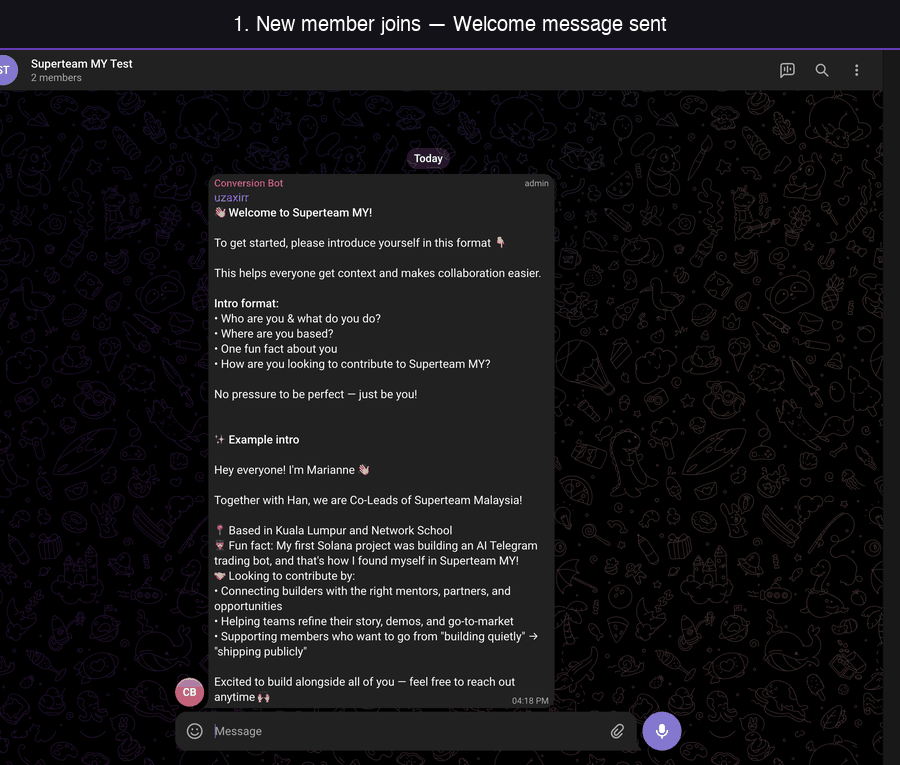
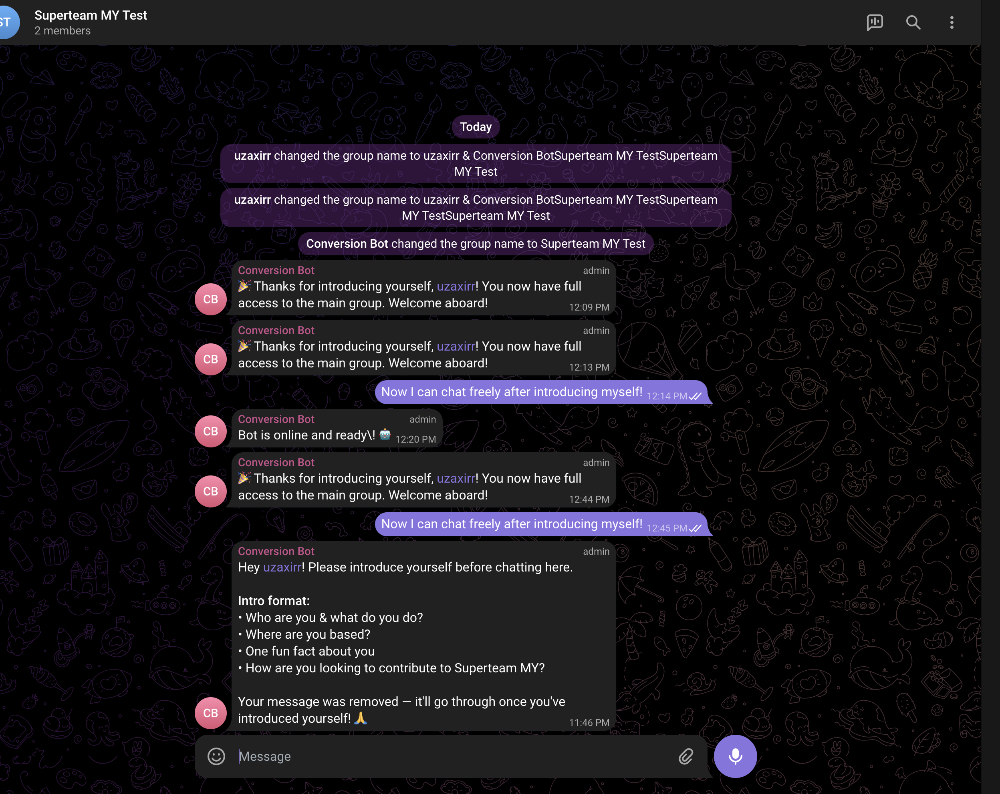
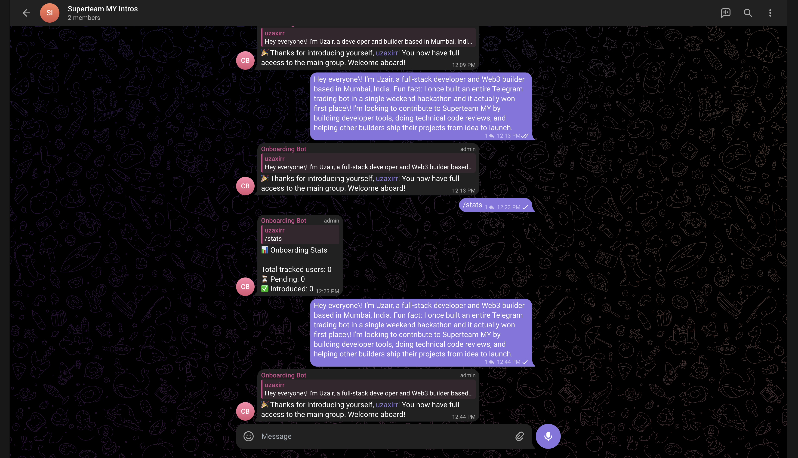
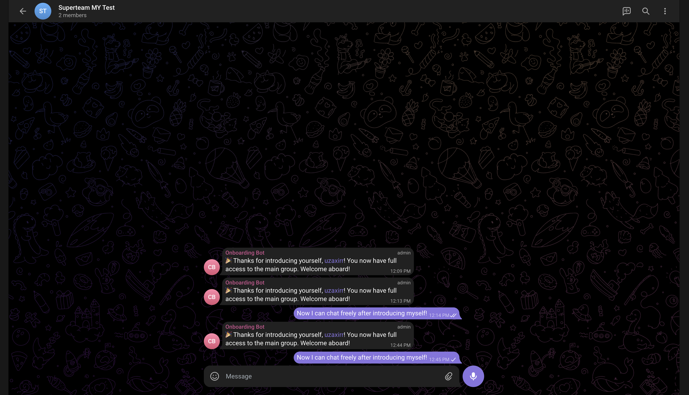
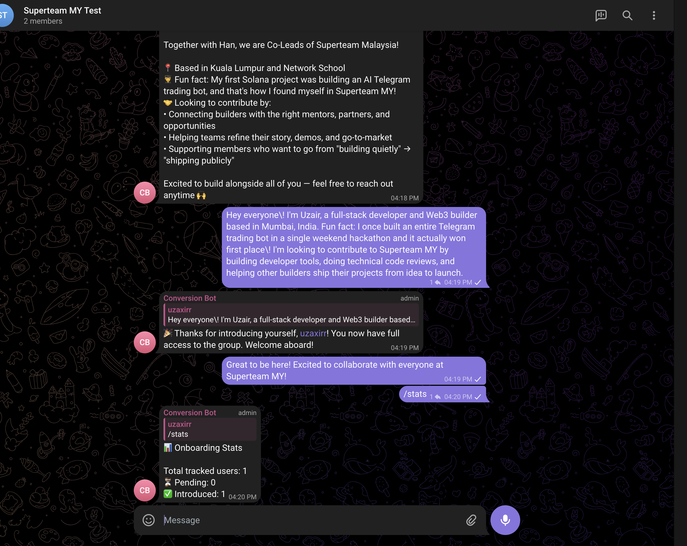

# Superteam MY — Telegram Onboarding Bot

A Telegram bot that onboards new members by requiring them to introduce themselves in a dedicated Intro Channel before they can participate in the main group.

## Features

- **New member detection** — Detects when users join the main group via `ChatMemberUpdated`
- **Auto-restriction** — New members cannot send messages in the main group until they introduce themselves
- **Welcome message** — Sends a formatted welcome with the intro template and an example
- **Intro validation** — Heuristic check that the introduction roughly follows the expected format
- **Auto-unrestriction** — Once a valid intro is posted, the user gains full access to the main group
- **Enforcement** — Messages from non-introduced users in the main group are auto-deleted with a reminder
- **Admin commands** — `/reset`, `/approve`, `/status`, `/stats`
- **Persistent storage** — SQLite database survives restarts
- **Edge case handling** — Leave & rejoin, bot restart, deleted intros

## Demo

### Quick Overview



### Live Test Groups

Want to try it yourself? Join the test groups and experience the full onboarding flow:

1. **Join the main group:** [Superteam MY Test](https://t.me/+vRitdSyP82w3MmQ1)
2. **Join the intro channel:** [Superteam MY Intros](https://t.me/+GXFccFwx0_E1Mjg1)
3. Try sending a message in the main group — it will be deleted with a reminder
4. Post your intro in the intro channel — the bot will validate and approve you
5. Now you can chat freely in the main group

> A [demo video](screenshots/demo.mp4) is also available in the repo.

### Screenshots

<details>
<summary>Click to expand screenshots</summary>

#### Enforcement — Non-introduced users can't chat

When a user who hasn't introduced themselves tries to send a message in the main group, the bot automatically deletes it and sends a reminder pointing them to the Intro Channel.



#### Intro Validation & Acceptance

Once the user posts a valid introduction in the Intro Channel, the bot validates it and confirms acceptance. The user is notified in both the intro channel and the main group.



#### Post-Intro — Full Access Granted

After completing their introduction, the user can freely participate in the main group with no restrictions.



#### Admin Stats

Admins can use `/stats` to get a quick overview of onboarding progress — total tracked users, pending intros, and completed intros.



</details>

---

## Setup

### Prerequisites

- Python 3.11+
- A Telegram bot token from [@BotFather](https://t.me/BotFather)
- The bot must be an **admin** in both the main group and the intro channel with permissions to:
  - Delete messages
  - Restrict members
  - Send messages

### BotFather Configuration

**Important:** You must enable "Group Privacy" mode or disable it depending on your needs:
1. Go to [@BotFather](https://t.me/BotFather)
2. `/mybots` → Select your bot → Bot Settings → Group Privacy → **Turn OFF**
   - This allows the bot to see all messages in groups (required for enforcement and intro detection)
3. Also enable "Allow Groups?" if not already enabled

### Getting Chat IDs

To get the chat IDs for your groups:
1. Add the bot to both groups
2. Send a message in each group
3. Visit `https://api.telegram.org/bot<YOUR_TOKEN>/getUpdates`
4. Find the `chat.id` values for your groups (they'll be negative numbers like `-1001234567890`)

### Environment Variables

Copy the example env file and fill in your values:

```bash
cp .env.example .env
```

| Variable | Description | Required |
|---|---|---|
| `BOT_TOKEN` | Telegram bot token from BotFather | Yes |
| `MAIN_GROUP_ID` | Chat ID of the main group | Yes |
| `INTRO_CHANNEL_ID` | Chat ID of the intro channel/group | Yes |
| `ADMIN_IDS` | Comma-separated Telegram user IDs for admins | Yes |
| `MIN_INTRO_LENGTH` | Minimum character length for intros (default: 50) | No |
| `DB_PATH` | SQLite database path (default: `data/bot.db`) | No |

### Run Locally

```bash
# Create virtual environment
python -m venv .venv
source .venv/bin/activate

# Install dependencies
pip install -r requirements.txt

# Run the bot
python -m bot.main
```

### Run with Docker

```bash
# Build and start
docker compose up -d

# View logs
docker compose logs -f bot

# Stop
docker compose down
```

## Admin Commands

All commands are restricted to user IDs listed in `ADMIN_IDS`.

| Command | Description | Usage |
|---|---|---|
| `/reset` | Reset a user's intro status and re-restrict them | Reply to a message or `/reset <user_id>` |
| `/approve` | Manually approve a user (skip intro requirement) | Reply to a message or `/approve <user_id>` |
| `/status` | Check a user's onboarding status | Reply to a message or `/status <user_id>` |
| `/stats` | Show overall onboarding statistics | `/stats` |

## How It Works

```
User joins main group
        │
        ▼
Bot restricts user (no send permission)
Bot sends welcome message with intro format
        │
        ▼
User posts in Intro Channel
        │
        ▼
Bot validates intro (heuristic check)
        │
   ┌────┴────┐
   ▼         ▼
 Valid     Too short
   │         │
   ▼         ▼
Unrestrict  Nudge to
in main     add more
group       detail
```

## Project Structure

```
tg-mal/
├── bot/
│   ├── main.py              # Entry point
│   ├── config.py             # Configuration & message templates
│   ├── database.py           # SQLite operations
│   ├── handlers/
│   │   ├── welcome.py        # New member detection + welcome message
│   │   ├── intro.py          # Intro channel monitoring + validation
│   │   ├── enforcement.py    # Main group message filtering
│   │   └── admin.py          # Admin commands
│   └── utils/
│       └── validation.py     # Intro format heuristic checker
├── screenshots/              # Demo screenshots
├── .env.example
├── Dockerfile
├── docker-compose.yml
├── requirements.txt
└── README.md
```

## Validation Logic

The bot uses a heuristic scoring system (not strict enforcement) to check intros:

- **Length** — At least 50 characters
- **Identity** — Mentions who they are / what they do
- **Location** — Mentions where they're based
- **Fun fact** — Shares something personal
- **Contribution** — Mentions how they want to contribute

A score of 3/5 or higher is accepted. Below that, the bot gently nudges the user to add more detail without blocking them.
